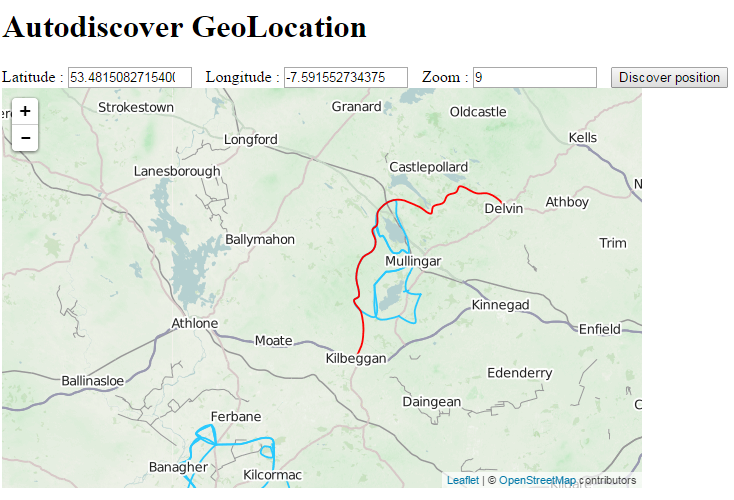

## GeoLocation with AngularJS & LeafletJS 

This App requires access to your location. It finds the co-ordinates of your location and centers the map there.

### App Specifics

The App makes use of the __angular-leaflet-directive__ created by [David Rubert](https://github.com/tombatossals/angular-leaflet-directive). The directive enables Angular to interact with maps managed by [LeafletJS](http://leafletjs.com/). This App is based on some of the examples given with the directive.

### Running the App

- clone the repository
- npm install
- bower install
- node server.js
- browse to _http://localhost:3040_

### Details

I have found that the location accuracy I have got from using the App to be over 50Km's off. This is quite poor. My Geo location was retrieved from my IP address. I ran __tracert google.ie__ from my Windows command terminal. The first hop from my home gateway is in the midlands. This is the location that the HTML5 Location service takes as my address.

Vastly increased accuracy should be realised if GPS is used instead of IP address. Also mobile phone tower triangulation calculations should produce a quite accurate location calculation if a mobile phone device is used. 

### NOTE

You can also use this App without without using a Node server.
However Chrome does not allow the HTML5 location service to be run on locahost. 
You can use another browser like _Firefox_ that supports the HTML5 Location service or if you have Python installed you can: 
- open the command terminal and go to the directory where the program resides
- run a simple webserver by entering __python -m SimpleHTTPServer__.  

## Screen Shot

	

Michael Cullen 2014

